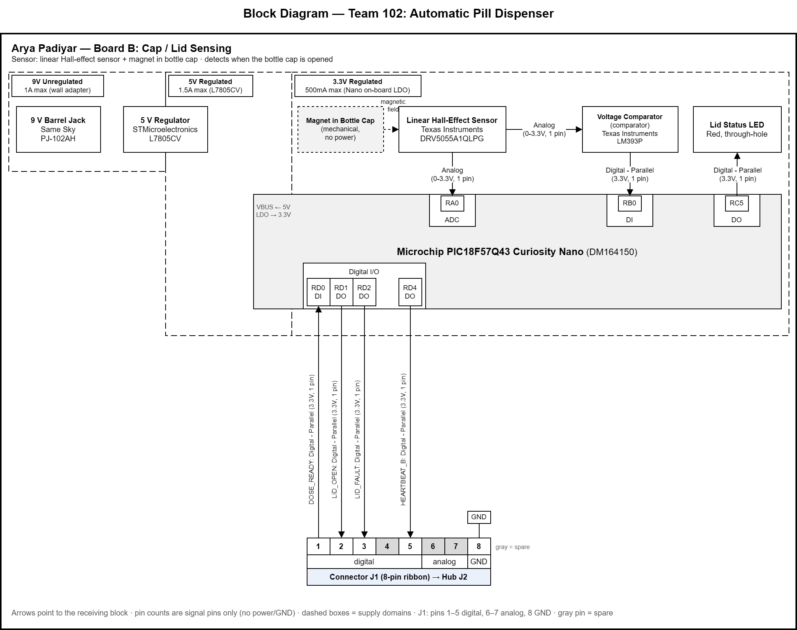

## Overview

**Arya Padiyar — Team 102: Automatic Pill Dispenser**
**Subsystem: Board B — Cap / Lid Sensing**

This block diagram shows how my subsystem, Board B, is laid out and how it connects to the team's hub board.

- **Power levels:** A 9V unregulated wall adapter enters through a DC barrel jack. An L7805CV linear regulator steps it down to 5V, which powers the PIC18F57Q43 Curiosity Nano through VBUS. The Nano's on-board LDO supplies 3.3V to the sensor, comparator and all logic.
- **Sensor:** A DRV5055 linear Hall-effect sensor detects a magnet in the bottle cap. Its analog output goes to the ADC on RA0, so I can read the raw field strength, and to an LM393 comparator. The comparator gives a clean open/closed digital signal on RB0.
- **Actuator / output:** A red status LED on RC5 shows the lid state locally.
- **Team connections:** Board B connects to the hub (J2) through 8-pin ribbon connector J1, following the class standard: pins 1–5 digital, 6–7 analog, 8 GND. I use pins 1, 2, 3 and 5, and pins 4, 6 and 7 are spare.

## Block Diagram

## Connector J1 → Hub J2

| J1 Pin | Signal | Direction | MCU Pin | Type |
|---|---|---|---|---|
| 1 | DOSE_READY | Hub → Board B | RD0 (DI) | Digital - Parallel (3.3V, 1 pin) |
| 2 | LID_OPEN | Board B → Hub | RD1 (DO) | Digital - Parallel (3.3V, 1 pin) |
| 3 | LID_FAULT | Board B → Hub | RD2 (DO) | Digital - Parallel (3.3V, 1 pin) |
| 4 | — | Spare (digital) | — | — |
| 5 | HEARTBEAT_B | Board B → Hub | RD4 (DO) | Digital - Parallel (3.3V, 1 pin) |
| 6 | — | Spare (analog) | — | — |
| 7 | — | Spare (analog) | — | — |
| 8 | GND | — | GND | — |

## Major Components

| Function | Manufacturer | Part Number | Supply |
|---|---|---|---|
| Microcontroller | Microchip | PIC18F57Q43 Curiosity Nano (DM164150) | 5V in / 3.3V logic |
| Linear Hall-effect sensor | Texas Instruments | DRV5055A1QLPG | 3.3V |
| Voltage comparator | Texas Instruments | LM393P | 3.3V |
| 5V linear regulator | STMicroelectronics | L7805CV | 9V in / 5V out |
| DC barrel jack | Same Sky | PJ-102AH | 9V |
